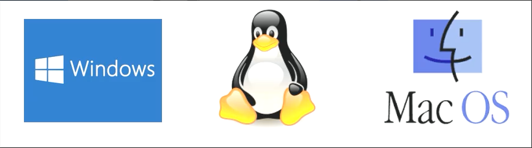
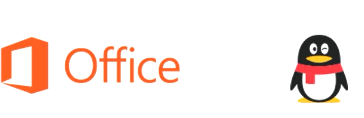
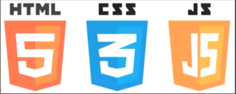
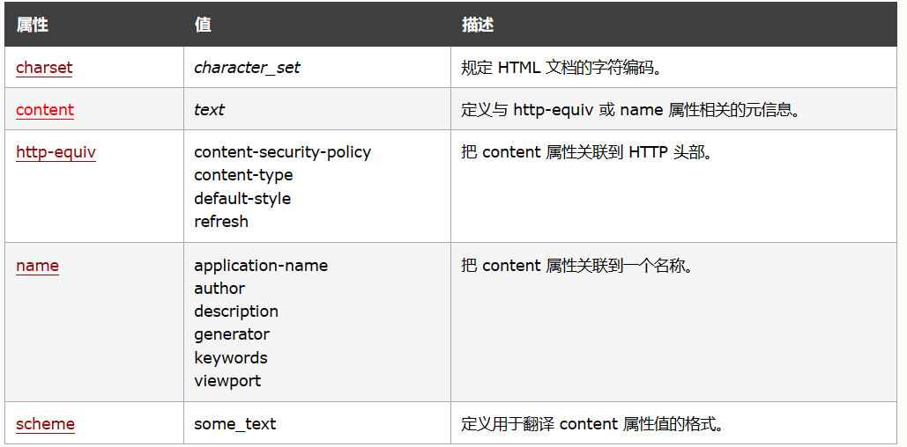

{
    "author": {
        "name": "孙锦",
        "url": "https://github.com/Kiritoabc"
    },
    "departments": [
        {
            "name": "  杭州电子科技大学 ",
            "url": "[杭州电子科技大学 (hdu.edu.cn)](https://www.hdu.edu.cn/main.htm)",
            "img_url": "./img/hdu-logo.jpg"
        },
        {
            "name": "计算机学院",
            "url": "[计算机学院 (hdu.edu.cn)](https://computer.hdu.edu.cn/main.htm)",
            "img_url": "./img/hdu.jpg"
        },
        {
            "name": "Mooc社团",
            "url": "",
            "img_url": "./img/mooclogo.png"
        }
    ]
}

+++++

# 前端基础知识分享

----

## Overview

本次分享的主要内容

+ 前端的简单介绍
+ 前端开发的一些准备

---


# Q1: 为什么学前端?

----
## 为什么学前端?


为什么学前端呢?

+ 为什么要学微积分/离散数学/XXXX/……？
+ 长辈/学长：<del>擦干泪不要问为什么</del>

<hr>

你的选择?

--

+ 前端是入门门槛最低的编程领域之一?
+ 前端能够让你快速看到自己的成果?
+ 前端具有非常广阔的发展前景?
+ 都不是，只是学着玩？？？

---

# Q2：到底什么是前端捏？

----

## 什么是前端？

>Web前端: 顾名思义是来做Web的前端的。我们这里所说的前端泛指Web前端，也就是在Web应用中用户可以看得见碰得着的东西。包括Web页面的结构、Web的外观视觉表现以及Web层面的交互实现。

<hr>
--

为此，前端开发者需要深入掌握三种语言： **HTML**、**CSS** 以及 **Javascript**。

+ HTML——超文本标记语言——是网页的骨架，是每个网站必备的基础。
+ CSS——层叠样式表——是让HTML结果变得更加好看的样式规则。
+ 最后是 Javascript，它是网页动画与交互的魔法之源，也是构建一个 Web 应用的核心部分。

----

## 什么是前端---软件的分类
系统软件


--
应用软件


----
## 什么是前端---客户端与服务器
通常情况下，现在的软件一般由两个部分组成：

+ 客户端：用户通过客户端来使用软件。
+ 服务器：服务器负责在远程处理业务逻辑。

--
服务器开发的语言： Java,Node,PHP,C#,Python,Go......

客户端的形式:

+ 文字客户端：占老的方式，通过命令行来使用软件
+ 图形化界面：通过点击拖动等来使用软件。Windows中、macOS中、Android、iOS中的大部分应用。（C/S架构）
+ 网页：通过访问网页来使用软件。所有的网站都属于这个范畴。（B/S架构）

----
## 什么是前端---网页的特点
相较于传统的图形化界面，网页具有如下一些优点：

+ 不需要安装
+ 无需更新
+ 跨平台

网页中使用的语言：

+ HTML、CSS、JavaScript


---
# 前端三剑客---HTML，CSS，JS

----
## 前端三剑客---结构、表现、行为

+ 结构（骨架）：HTML用于描述页面的结构
+ 表现（皮肤）：CSS用于控制页面中元素的样式
+ 行为（交互）：JavaScript用于响应用户操作

--


----
## 前端三剑客---HTML

什么是HTML

+ 超文本标记语言（Hyper Text Mark-up Language）
+ 用来设计网页的标记语言
+ 用该语言编写的文件，以.html或.htm为后缀
+ 由浏览器解释执行

----

## 前端三剑客---HTML
HTML5的基本结构
```html
<!-- 文档声明，声明当前网页的版本 -->
<!doctype html>
<!-- html的根标签（元素），网页中的所有内容都要写根元素的里边 -->
<html>
    <!-- head是网页的头部，head中的内容不会在网页中直接出现，主要用来帮助浏览器或搜索引擎来解析网页 -->
    <head>
        <!-- meta标签用来设置网页的元数据，这里meta用来设置网页的字符集，避免乱码问题 -->
        <meta charset="utf-8">
        <!-- title中的内容会显示在浏览器的标题栏，搜索引擎会主要根据title中的内容来判断网页的主要内容 -->
        <title>网页的标题</title>
    </head>
    <!-- body是htm1的子元素，表示网页的主体，网页中所有的可见内容都应该写在body里 -->
    <body>
        <!-- h1网页的一级标题 -->
        <h1>网页的大标题</h1>
    </body>
</html>
```


---

# 前端开发的一些准备

----
## 文本编辑器的选择

VS Code

+ Microsoft出品，轻量但强大，针对于编写现代Web和云应用的跨平台源代码编辑器。可以在Mac OS X、Windows和 Linux等操作平台使用。
+ 具有对JavaScript、TypeScript和Node.js的内置支持，并具有丰富的其他语言（例如C++，C＃，Java，Python，PHP，Go）和运行时（例如.NET和Unity）扩展的生态系统。
	+ 优点：免费开源，轻量流畅，功能丰富，支持插件，界面简洁，智能代码补全，运行速度很快
	+ 缺点：几乎没有什么太大的缺点

----
## 文本编辑器的选择

WebStorm

+ JetBrains 出品的智能 JavaScript IDE。誉为“Web前端开发神器”、“最强大的HTML5编辑器”、“最智能的JavaScript IDE”等。与IntelliJ IDEA同源，继承了IntelliJ IDEA强大的JS部分的功能。
+ IntelliJ IDEA 是java编程语言开发的集成环境。IntelliJ在业界被公认为最好的java开发工具，尤其在智能代码助手、代码自动提示、重构、JavaEE支持、各类版本工具(git、svn等)、JUnit、CVS整合、代码分析、 创新的GUI设计等方面的功能可以说是超常的。它的旗舰版本还支持HTML，CSS，PHP，MySQL，Python等。免费版只支持Java,Kotlin等少数语言。
	+ 优点：功能强大，支持插件，界面美观，智能代码补全，快速搜索
	+ 缺点：重量级，占内存；收费

---
# HTML

----
## HTML---字符实体
有些时候，在HTML中不能直接书写一些特殊符号：


----
## HTML---meta标签
meta主要用于设置网页中的一些元数据，元数据并不是给用户看的


----
## HTML---语义标签
在网页中HTML专门用来负责网页的结构所以在使用html标签时，应该关注的是标签的语义，而不是它的样式

<hr>

--

+ 标签: `<h1>` `<h2>` `<h3>` `<h4>` `<h5>` `<h6>`
+ 作用: 标题
+ 描述: 一共有六级标题从h1~ h6重要性递减，h1最重要，h6最不重要h1在网页中的重要性仅次于title标签

```html
<h1>Beetles</h1>
<h2>External morphology</h2>
<h3>Head</h3>
<h4>Mouthparts</h4>
<h5>Thorax</h3>
<h6>Prothorax</h4>
```

----
## HTML---语义标签

+ 标签: `<p>`
	+ 作用: 段落
	+ 描述: 页面中的一个段落。由空行或第一行缩进将相邻的文本块分开

<hr>

--

+ 标签: `<br>`
	+ 作用: 换行


----
## HTML---语义标签

HTML5 提供的新语义元素有


----
## HTML---布局标签

+ header表示网页的头部（页眉）
+ main表示网页的主体部分（一个页面中只会有一个main）
+ footer表示网页的底部（页脚）
+ nav表示网页中的导航
+ aside和主体相关的其他内容（侧边栏）
+ article表示一个独立的文章
+ section表示一个独立的区块，上边的标签都不能表示时使用section
+ div 块元素，没有任何的语义，就用来表示一个区块。目前来讲，div还是主要的布局元素
+ span 行内元素，没有任何的语义，一般用于在网页中选中文字

----
## HTML---其他标签

+ 列表相关的
+ 超链接
+ 图片
+ 内联格式
+ 音频
+ ......

[推荐去MDN查看文档学习](https://developer.mozilla.org/zh-CN/)